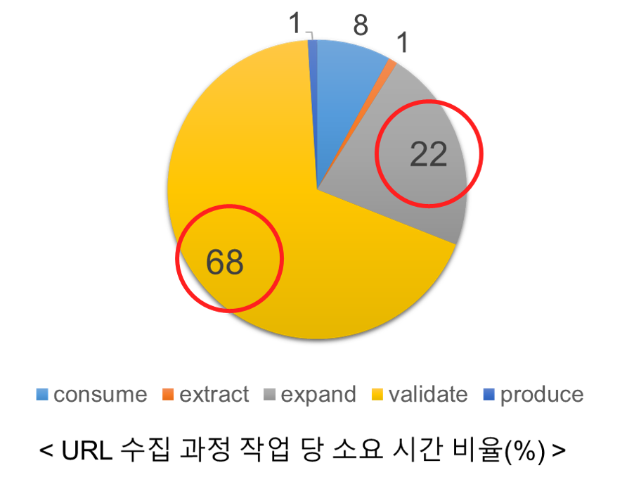
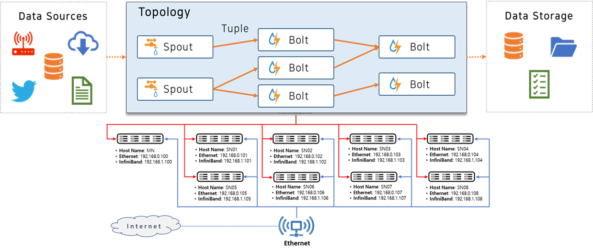
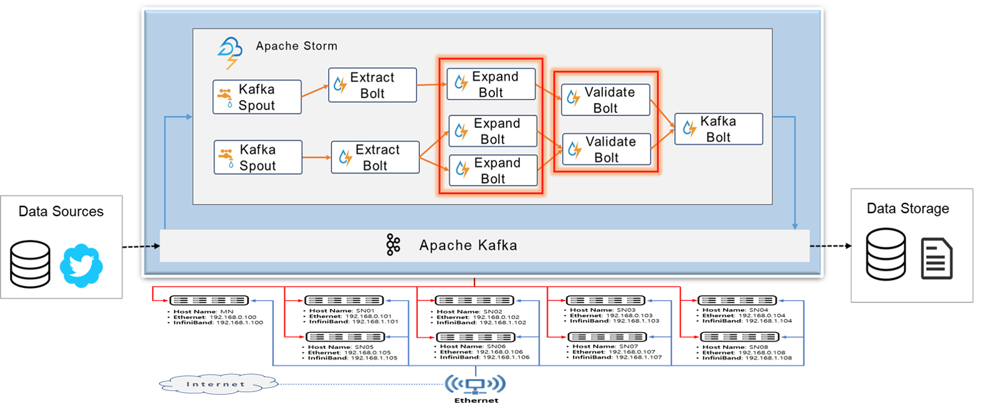

# Twit-URL-Extract-App
Apache Storm 기반 실시간 트윗 URL 수집 시스템
Real-time URL Collection System in Tweet using Apache Storm 

(paper) [SNS 환경에서 Apache Storm 기반 실시간 URL 수집 시스템](https://github.com/Juhong-Namgung/TwitURLExtractApp/blob/master/paper/SNS%20%ED%99%98%EA%B2%BD%EC%97%90%EC%84%9C%20Apache%20Storm%20%EA%B8%B0%EB%B0%98%20%EC%8B%A4%EC%8B%9C%EA%B0%84%20URL%20%EC%88%98%EC%A7%91%20%EC%8B%9C%EC%8A%A4%ED%85%9C.pdf)

--- 
## URL 수집
URL 데이터 수집 요구사항
1) URL 추출
	- 복합적인 구조의 SNS 데이터에서 URL만을 분리
2) 단축 URL 확장
	- 단축 URL: 길이가 긴 원본 URL을 짧은 URL로 대체하여 사용하는 방식
	- 실제 URL이 가지고 있는 정보를 숨기고 있음
	-  단축 URL을 확장하여 원본 URL 파악
3) 죽은 링크 판별
	- 죽은 링크: 영구적으로 이용할 수 없는 웹 페이지나 서버를 가리키는 링크
	- 죽은 링크에 접속 시 특정 페이지를 찾을 수 없는 HTTP 404 오류 발생
	- URL의 접속 상태 검증을 통해 죽은 링크 판별

	

→ 요구사항을 만족하는 시스템을 단일 노드에서 동작시키면 특정 작업에 부하 발생

## Apache Storm
 * 분산 병렬 환경에서 스트리밍 데이터를 처리하는 대표적인 오픈소스 프레임워크
 * 토폴로지(Topology)로 입출력과 처리를 정의하고 동작
	- 스파우트(Spout): 데이터 소스를 튜플로 바꾸어 스트림 데이터 형태로 볼트에 전달
	- 볼트(Bolt): 받은 데이터를 처리하여 다음 볼트에 전달하거나 처리결과를 외부에 저장
 

	
* Storm의 병렬성 활용
	- 부하가 생기는 작업을 여러 개의 객체인 볼트로 동작
	- 주요 병목인 단축 URL 확장 Bolt(ExpandBolt)와 죽은 링크 판별 Bolt(ValidationBolt) 수 증가

